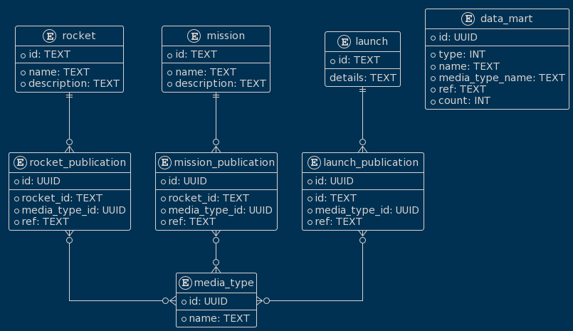
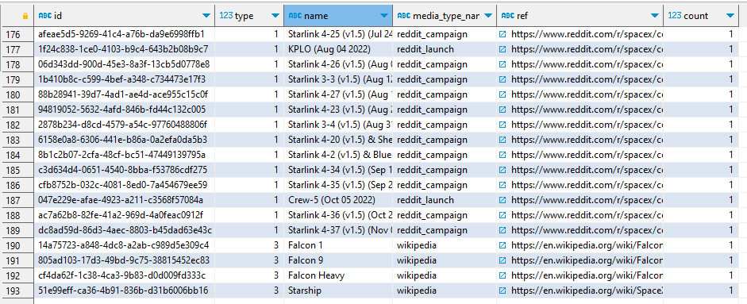

# SpaceX Data Mart

Реализация тестового задания https://www.notion.so/d90b6cd1e9744a118b7b7807598faff5

- Написать сервис/скрипт, который загружает данные из [GraphQL API](https://studio.apollographql.com/public/SpaceX-pxxbxen/home) в базу данных Postgres.
- Спроектировать модель данных с витринами данных. Например [тут](https://www.diagrams.net/).
- Написать сервис/скрипт, который наполняет спроектированные таблицы.
- Создать витрину данных, которая подсчитывает количество публикаций по миссиям, ракетам и пускам (missions, rockets and launches).
- Написать `Dockerfile` и `docker-compose.yml`, которые позволят нам запустить твой код и делать запросы к БД ( `docker compose up -d` )
- Залить проект на [GitHub](https://github.com/) и поделиться с нами ссылкой на него (сделать публичным). А также ссылкой на модель данных.

## Запуск

1. Клонировать репозиторий `git clone https://github.com/sklimoff/spacex_mart.git`
2. Создать и заполнить файл `.env` по образу `.env-example` (можно просто скопировать "как есть") 
3. Выполнить команду `docker compose up -d`

Скрипт будет выполнен в контейнере, результирующая база данных (PostgreSQL) будет доступна на `localhost:25432`

## Как была понята и реализована задача?

Выбрать все публикации по сущностям `rocket`, `mission` и `launch`. Под публицаями подразумеваются ссылки в интернете. Были выбраные следующие поля сущностей для хранания и дальнейшего преобразования в витрину:
- `launch.links.article_link`
- `launch.links.presskit`
- `launch.links.reddit_campaign`
- `launch.links.reddit_launch`
- `launch.links.reddit_media`
- `launch.links.reddit_recovery`
- `launch.links.video_link`
- `launch.links.wikipedia`
- `mission.twitter`
- `mission.website`
- `mission.wikipedia`
- `rocket.wikipedia`

В результате получилась такая структура для хранения:

Были применены следующие основные технологии/либы: `SQLAlchemy`, `alembic`, `pydantic`, `requests`, `graphql_query`

Результирующая объединенная витрина получилась такой:

## Не сделано (а хотелось бы)

- [ ] Не получилось вытянуть данные с ендпоинта `missions` (всегда возрващается пустой список) - либо недоразобрался с `GraphQL`, либо с датасетом что-то не так
- [ ] В основном скрипте **очень** много дублирубщегося кода, можно было бы унифицировать. Посыпаю голову пеплом - не хватило времени и концентрации. Возможно, `SQLAlchemy` избыточна для задачи.
- [ ] Не реализована обработка ошибок
- [ ] Не реализовано логгирование
